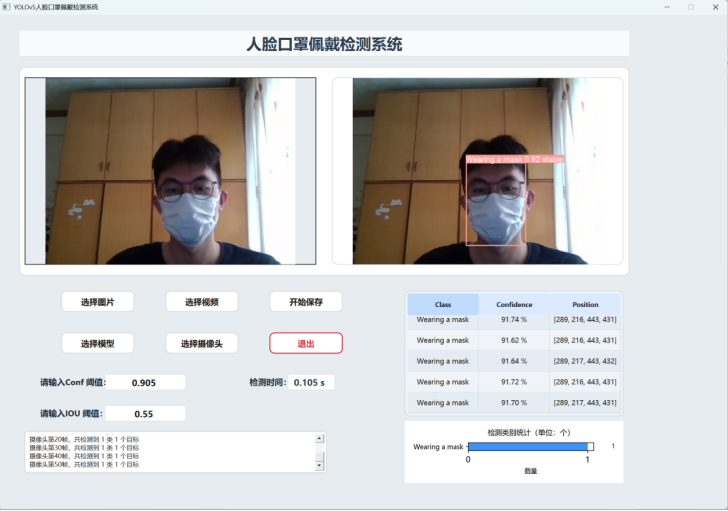
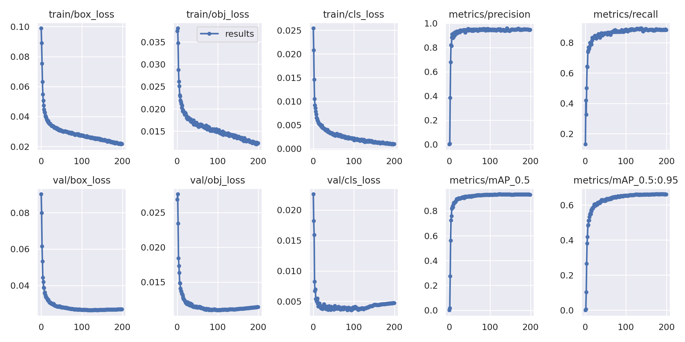

# YOLOv5-GCDAF 智能目标检测平台

一个基于 YOLOv5 与自研 GC-DAF 特征增强模块的桌面端目标检测系统。项目提供 PyQt5 图形界面，支持图片、视频和摄像头输入，并集成模型切换、阈值配置、检测结果统计与结果保存等功能。

## 项目展示

### 系统界面

桌面平台支持图片、视频和摄像头检测，并展示原始画面、检测结果、目标明细、耗时日志与类别统计。



### 训练过程

下图展示 200 个训练轮次内的损失、Precision、Recall、mAP@0.5 与 mAP@0.5:0.95 变化趋势。



## 项目亮点

- 在 YOLOv5 主干网络中集成 GC-DAF 模块，加强上下文信息与多尺度特征表达。
- 支持图片、视频、摄像头三类检测输入。
- 提供置信度和 IoU 阈值配置、检测明细表、类别统计图与运行日志。
- 支持运行时加载本地模型，便于比较不同训练权重。
- 保留训练、验证、导出、推理以及完整桌面平台源码。

## 代码结构

```text
yolov5-GCDAF模型/
├── main.py                 # 桌面平台入口
├── detect_tools.py         # 图像与检测结果处理
├── UI/                     # PyQt5 界面代码及必要资源
├── data/tricks/C3GC.py     # GC-DAF 核心实现（兼容名称 C3GC）
├── models/                 # YOLOv5 网络定义
├── utils/                  # 数据加载、推理与通用工具
├── yolov5s-GCDAF.yaml      # GC-DAF 网络配置
├── train.py                # 训练入口
├── val.py                  # 验证入口
└── detect.py               # 命令行推理入口
```

## 本地运行

建议使用 Python 3.9 或 3.10，并根据本机 CUDA 环境安装匹配版本的 PyTorch。

```bash
cd yolov5-GCDAF模型
pip install -r requirements.txt
python main.py
```

公开仓库不包含训练数据、实验结果和模型权重。平台启动后，请通过“模型选择”加载本地 `.pt` 权重文件，再进行检测。

## 模型训练

准备符合 YOLO 格式的数据集并修改数据 YAML 后，可执行：

```bash
python train.py --cfg yolov5s-GCDAF.yaml --data path/to/dataset.yaml --weights ''
```

## 隐私与仓库说明

本仓库仅发布项目源码、网络配置和必要界面资源。训练数据、对比实验结果、模型权重、运行输出以及本地用户数据均未纳入版本控制。

## 致谢与许可

检测框架基于 [Ultralytics YOLOv5](https://github.com/ultralytics/yolov5) 开发，原始框架遵循 AGPL-3.0 License。本项目的 GC-DAF 模块和桌面平台功能是在该基础上的扩展实现，许可信息见 `yolov5-GCDAF模型/LICENSE`。
